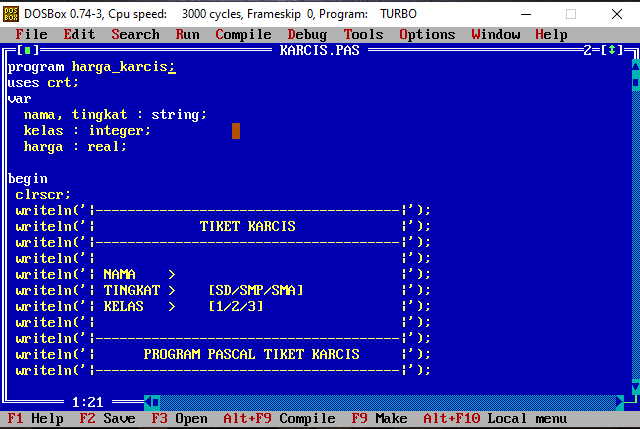
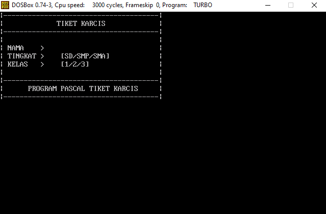
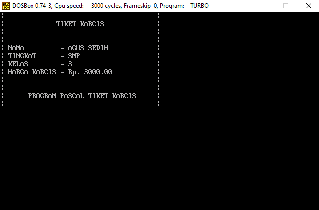

<h1>PROGRAM PENJUALAN KARCIS SEDERHANA MENGGUNAKAN PASCAL</h1>

===================== program by yogi syahputra ========================= 

tata cara memasukkan dan menjalankan program : 

1. pastikan kamu mempunyai aplikasi turbo pascal 
2. copy file KARCIS.PAS 
3. pergi ke C:\TPWDB\BIN 
4. tempel file KARCIS.PAS di situ 
5. buka aplikasi turbo pascal, lalu cari nama file yang kamu tempel tadi. 

========================= Selamat Belajar ================================ 

<h3> Program </h3>

<h3> input </h3>

 

<h3> Out </h3>

